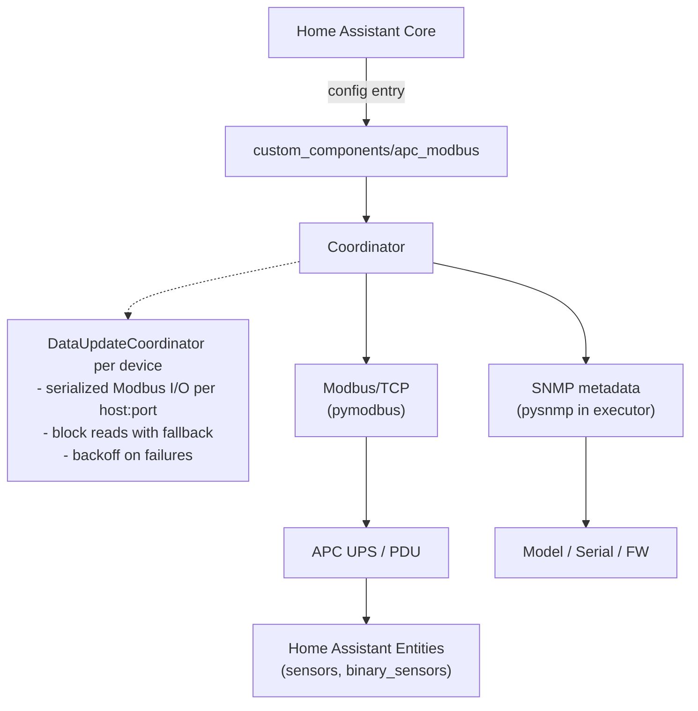

# APC UPS Modbus Integration for Home Assistant


A Home Assistant integration for monitoring APC power devices via Modbus/TCP with SNMP metadata.

Supported device families include:
- Legacy Smart-UPS
- Smart-UPS SMT/SMX/SRT
- NetShelter Rack PDU

This custom-component runs standalone and DOES NOT require additional components such as NUT or APCUPSD.

Modbus/TCP is an extremely efficient method for collecting bulk data at a high rate and is used in industrial automation services for
this purpose.

If you do not have a Modbus enabled APC device the project at https://github.com/aburow/ups-snmp-ha provides a similar capability using SNMP only.

## Features

### Multi-Device Support
- **Smart-UPS**: Traditional APC Smart-UPS devices
  - 39 comprehensive sensors
  - 12 binary sensors for status monitoring
  - Full battery and load monitoring

- **NetShelter Rack PDU**: APC power distribution units
  - Dynamic entity creation based on device capabilities
  - Device-level power measurements (kW, kVA, kWh)
  - Per-phase measurements (L1, L2, L3) with current, voltage, power
  - Per-outlet monitoring (up to 64 metered outlets)
  - Per-bank monitoring (up to 12 banks)

### Smart-UPS Sensors (43 total)
- Input/output voltage and current
- Battery charge percentage and runtime
- Load percentage and transfer switch status
- Temperature and firmware information
- External temperature/humidity probes via SNMP (for supported environmental modules such as AP9335T/AP9335TH)
- Input/output frequency
- Real-time power measurements
- Status bits and fault indicators
- And more...

### External Probe Behavior (AP9335T/AP9335TH)
- External probe sensors are optional and are created only when probe values are returned by SNMP.
- If no compatible probe is connected, those entities are not created (instead of showing permanently unavailable sensors).
- Temperature is reported as native Celsius and exposed with Home Assistant temperature device class, so UI/unit settings can convert to Fahrenheit automatically.

### Core Features
- **SNMP Required**: SNMP queries retrieve device model, serial number, firmware information
- **Device Family Coverage**: Legacy Smart-UPS, Smart-UPS SMT/SMX/SRT, and NetShelter Rack PDU
- **Dynamic Entity Generation**: Rack PDU creates only sensors for present hardware (no placeholder entities)
- **Easy Configuration**: Setup auto-detects UPS vs Rack PDU and picks the correct UPS register family
- **Manual Diagnostics Button**: Per-device `Run Diagnostics` button captures SNMP + Modbus raw dump and displays it in a Home Assistant persistent-notification modal for quick troubleshooting
- **Targeted Re-detection**: Device family probes run on first add, when strong SNMP identity conflicts with the stored family, or when you manually trigger re-detection
- **No Re-detect On Connection Loss**: Temporary Modbus connectivity failures do not trigger automatic family rediscovery for already classified devices
- **Manual Re-detect Button**: Per-device `Re-detect Device Type` button reruns Modbus family probing and reloads the integration entry only when the stored type or detection metadata actually changes
- **Startup Load Smoothing**: Large fleets are staggered deterministically during startup so initial SNMP metadata, Modbus detection, capability discovery, and first refresh do not all hit at once
- **Resilient Modbus Compatibility**: Read calls adapt across common `pymodbus` unit-id API variants used in different environments
- **Local Communication**: Direct TCP/Modbus protocol (no cloud dependency)
- **Block Read Optimization**: Efficient register polling with fallback to individual reads

## Architecture



## Installation

### Using HACS (Recommended)

1. Go to HACS in Home Assistant
2. Click the three-dot menu and select "Custom repositories"
3. Add repository: `https://github.com/aburow/apc-modbus-snmp-ha`
4. Select "Integration" category
5. Install "APC UPS Modbus"
6. Restart Home Assistant

### Manual Installation

1. Copy `custom_components/apc_modbus/` to `config/custom_components/` on your Home Assistant instance
2. Restart Home Assistant
3. Go to Settings → Devices & Services → Integrations
4. Click "Create Integration"
5. Search for "APC UPS Modbus"

## Configuration

After installation, set up the integration through the UI:

1. Go to **Settings → Devices & Services → Integrations**
2. Click **Create Integration**
3. Search for and select **APC UPS Modbus**
4. Fill in the required configuration:
   - **Host**: Modbus/TCP host name or address of the device
   - **SNMP Community**: SNMP community string (default: "public")
5. Optional advanced settings:
   - **Device Name**: Friendly name for the device (default: "APC UPS")
   - **Port**: Modbus/TCP port (default: 502)
   - **Unit ID**: Modbus unit ID (default: 1)
   - **Scan Interval**: Update interval in seconds (default: 10)

The integration auto-detects whether the device is a UPS or Rack PDU, and for UPS devices it auto-selects the correct register family.

### SNMP Requirements

SNMP is **required to be enabled** on the device, but metadata retrieval is optional:
- The integration will retry SNMP queries 3 times at startup
- During auto-detect setup, metadata lookup queries both UPS and Rack PDU OID families to populate correct device info fields
- If SNMP queries fail, setup proceeds without device metadata (Modbus still works)
- Device info (model, serial, firmware) will be empty until SNMP succeeds
- Once SNMP becomes available, metadata is retrieved on next restart
- The integration relies on Home Assistant's bundled SNMP support and does not add a separate `pysnmp` dependency
- Current SNMP implementation uses SNMP v2c reads in this integration path

**Recommended Setup:**
- Ensure SNMP is enabled on the device (port 161)
- Use the correct SNMP community string (usually "public")
- Ensure network path is open between Home Assistant and device port 161
- If setup fails, check Home Assistant logs for SNMP error details

**Fallback Behavior:**
- If SNMP is unavailable at startup, the integration will still function
- All Modbus sensors will work normally
- Device info will show as unavailable until SNMP is accessible
- No loss of Modbus monitoring functionality

## Supported Devices

### Smart-UPS
- Smart-UPS 500 / 750 / 1000 / 1500 / 2200 / 3000 VA and larger
- Smart-UPS VT series
- Smart-UPS C series
- Any Smart-UPS model with Modbus/TCP support

**Tested on:**
- Smart-UPS 1500
- Smart-UPS 3000

### NetShelter Rack PDU
- AP8xxx series (e.g., AP8652, AP8861)
- APDU models (e.g., APDU4-XM)
- Any NetShelter Rack PDU with Modbus/TCP support

**Capabilities:**
- 1 or 3 phase power distribution
- Up to 64 metered outlets
- Up to 12 branch circuits/banks
- Per-phase and per-outlet energy monitoring

**Tested on:**
- NetShelter Rack PDU AP8XXX series

## Requirements

- Home Assistant 2024.1 or later
- APC UPS or Rack PDU with:
  - **Modbus/TCP** enabled (port 502, configurable)
  - **SNMP** enabled (port 161)
- Network connectivity to the device
- Python 3.13+ (built into current Home Assistant)

## Tested Platforms

- Home Assistant Core runtime on Python 3.13
- APC Smart-UPS legacy family (examples tested: Smart-UPS 1500, Smart-UPS 3000)
- APC Smart-UPS SMT/SMX/SRT register family (multiple field dumps validated)
- APC NetShelter Rack PDU family (AP8xxx series in mixed single/three-phase deployments)

## Compatibility

- Uses Home Assistant runtime dependencies (no bundled `pymodbus` or `pysnmp` libraries are installed by this integration).
- Supports common `pymodbus` unit-id calling variants (`device_id`, `slave`, `unit`, positional fallback) to tolerate runtime version differences.
- Designed to remain stable even when other custom integrations alter the Home Assistant Python package set.

## Entity Discovery

### Smart-UPS
All 51 entities (39 sensors + 12 binary sensors) are created automatically upon setup.

### NetShelter Rack PDU
Entity creation is dynamic based on device capabilities:
- **Device-level sensors**: Always created (1 set)
  - Real Power, Apparent Power, Power Factor, Energy, Load State
- **Phase sensors**: Created based on number of phases (×1 or ×3)
  - Phase Current, Voltage, Power, Apparent Power, Power Factor, State
- **Outlet sensors**: Created for each metered outlet (×0-64)
  - Outlet Current, Power, Energy, Alarm State
- **Bank sensors**: Created for each bank (×0-12)
  - Bank Current, State

Rack PDU state-code sensors are exposed as human-readable text:
- Load/Phase/Bank State: `Unknown`, `Low`, `Normal`, `Near Overload`, `Overload`
- Outlet Alarm State: `Unknown`, `No Alarm`, `Warning`, `Alarm`, `Critical`

**Example:** A 3-phase Rack PDU with 24 metered outlets and 6 banks creates:
- 5 device-level sensors
- 18 phase sensors (6 per phase × 3 phases)
- 96 outlet sensors (4 per outlet × 24 outlets)
- 12 bank sensors (2 per bank × 6 banks)
- **Total: 131 entities**

## Troubleshooting

### Enable Home Assistant Debug Logging

When diagnosing setup, SNMP, or Modbus issues, enable debug logging for this integration in `configuration.yaml`:

```yaml
logger:
  default: info
  logs:
    custom_components.apc_modbus: debug
```

After updating the logger configuration:
- Restart Home Assistant
- Reproduce the issue
- Collect the relevant log lines from Home Assistant

At `info` log level, the coordinator now emits per-cycle boundary timing lines (`Starting update cycle` and `Update cycle complete in ...s`) to help baseline poll performance without enabling full debug logging.

For deeper data collection outside Home Assistant, use the standalone debug tools here:
- https://github.com/aburow/apc_modbus_debug

That repository is intended for gathering raw SNMP and Modbus data for compatibility analysis.

The built-in diagnostics button also includes:
- raw block reads for the current collector set
- exact device-family probe calls used by Home Assistant detection
- a derived detection summary based on those same probe results

For device-family correction without deleting and re-adding an entry, use the built-in `Re-detect Device Type` button from the device page.

### SNMP Connection Failed (Device Info Not Populated)
- **Symptom**: Device model, serial number, and firmware info are not shown
- **Check logs for**: "Unable to retrieve SNMP metadata after 3 attempts"
- **Impact**: Integration still works - all Modbus sensors function normally, but device info is empty
- **Solution**:
  1. Verify SNMP is enabled on the device (check device configuration)
  2. Check SNMP community string (usually "public" by default)
  3. Verify network connectivity: `ping <device-host>`
  4. Check firewall rules allow port 161 (UDP)
  5. Verify no network path issues: `timeout 5 nc -u <device-host> 161`
  6. Test SNMP manually: `snmpget -v 2c -c public <device-host> 1.3.6.1.4.1.318.1.1.1.1.1.1.0`
  7. Once fixed, restart Home Assistant or reload the integration

**Note:** The integration will retry SNMP queries 3 times with delays, but won't block setup.

### Modbus Connection Issues
- **Error**: "Unable to connect to APC device"
- **Solution**:
  - Verify device host and port are correct
  - Check network connectivity: `ping <device-host>`
  - Ensure Modbus/TCP is enabled on the device

### PyModbus Environment Compatibility
- Home Assistant runtime behavior depends on the `pymodbus` version loaded in that environment.
- This integration now tolerates common unit-id call signatures (`device_id`, `slave`, `unit`, and positional fallback) to reduce version-skew issues.
- If another custom component alters your runtime package set, capture startup logs showing the detected `pymodbus` version for troubleshooting.
  - Check firewall rules allow port 502 (TCP)
  - Verify Home Assistant can reach port 502: `telnet <device-host> 502`

### Missing Rack PDU Sensors
- **Issue**: Fewer outlet/bank sensors than expected
- **Solution**:
  - This is expected behavior! Only metered outlets/banks are monitored
  - Check device configuration for number of metered outlets/banks
  - Read capability registers to verify device configuration

### Slow Updates
- **Issue**: Long update cycle time (> 15 seconds)
- **Solution**:
  - Reduce scan interval setting if too frequent
  - Check Home Assistant system performance
  - For Rack PDU with many outlets, expect longer update cycles
  - Verify network latency to device: `ping <device-host>`

### Large Fleet Startup Behavior
- **Behavior**: When many APC entries are present, startup work is staggered across a bounded window instead of all devices probing at once.
- **Why**: This reduces first-start polling spikes that can otherwise cause partial Modbus failures in larger deployments.
- **What to expect**:
  - Small fleets start immediately.
  - Larger fleets may take up to 60 seconds for the last APC entry to begin its heavy startup polling.
  - Normal steady-state polling cadence is unchanged after startup.

### Device Type Not Detected
- **Issue**: Auto-detection picks the wrong device family or setup fails
- **Solution**:
  - Review Home Assistant debug logs for the Modbus probe results
  - Confirm the device responds on Modbus/TCP port 502
  - Use the external dump/debug tooling to capture SNMP and Modbus responses for analysis

## Version History

For detailed release notes, see `CHANGELOG.md`.

### v1.2.2-dev.4 (Current Pre-release)
- ✅ Deterministic startup staggering for larger APC fleets
- ✅ Reduced synchronized first-run probe/load spikes during Home Assistant startup

### v1.1.0
- ✅ Automatic device-type detection (legacy Smart-UPS, SMT/SMX/SRT, Rack PDU)
- ✅ Improved Rack PDU detection and stale-entity cleanup
- ✅ Broader `pymodbus` runtime compatibility for Home Assistant environments
- ✅ Updated polling/decode behavior and display precision cleanup
- ✅ Documentation refresh for current Home Assistant/Python expectations

### v0.4.2
- 🐛 Fix startup crash when device_type not yet set

### v0.4.1
- 🔧 Added pacing delays between block reads (longer for Rack PDU)

### v0.4.0
- 🔧 Improved Modbus stability with per-endpoint serialization and per-cycle connect/close
- 🔧 Added reconnect/backoff logic and richer debug timing logs
- 🔧 SNMP metadata queries moved to executor to avoid loop blocking

### v0.3.4
- 🧰 Rack PDU SNMP OIDs and phase sensor block reads

## Support

- **Issues**: Report bugs on [GitHub Issues](https://github.com/aburow/apc-modbus-snmp-ha/issues)

## License

See LICENSE file for details.

## Credits

Developed for Home Assistant integration with APC UPS and Rack PDU devices via Modbus/TCP protocol.
