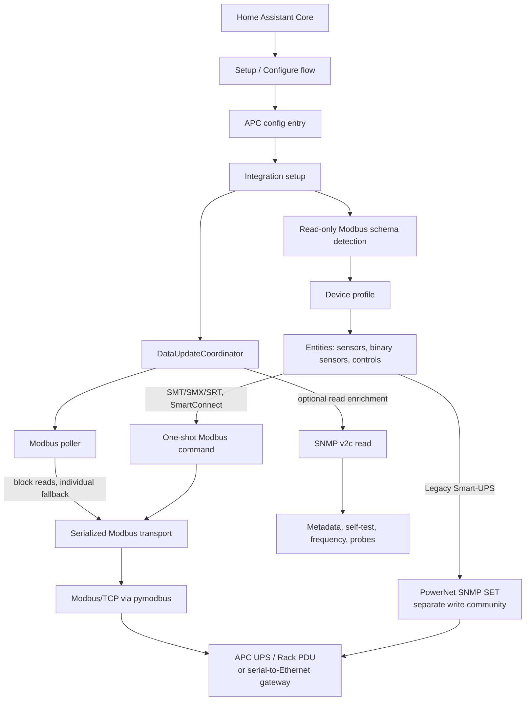

# APC UPS Modbus Integration for Home Assistant


[](https://analytics.home-assistant.io/custom_integrations.json)


A Home Assistant custom integration for APC UPS and Rack PDU monitoring over
Modbus/TCP, with optional SNMP v2c enrichment.

> **Write testing release:** `2.1.1` exposes experimental write controls through
> both MODBUS and SNMP depending on the device profile. All write commands are
> disabled by default. A user can enable these options in their own right and at
> their own risk. If you test this capability, please report the exact model and
> firmware whether there are issues or not; test only noncritical loads.

Supported device profiles are Legacy Smart-UPS, SMT/SMX/SRT, SmartConnect, and
NetShelter Rack PDU. Profiles are selected from read-only Modbus schema probes;
SNMP is not required for device-family detection.

This custom-component runs standalone and DOES NOT require additional components such as NUT or APCUPSD.

If you do not have a Modbus enabled APC device the project at https://github.com/aburow/ups-snmp-ha provides a similar capability using SNMP only.

## Features

### Smart-UPS Sensors
- Input/output voltage and current
- Battery charge percentage and runtime; remaining runtime supports Home Assistant duration-unit display preferences while retaining statistics
- Load percentage and transfer switch status
- Temperature and firmware information
- External temperature/humidity probes via SNMP (for supported environmental modules such as AP9335T/AP9335TH)
- Input/output frequency
- Real-time power measurements
- Status bits and fault indicators
- UPS efficiency, last status-change cause, and shutdown-imminent indicators on SMT/SMX/SRT and SmartConnect devices
- And more...

### Energy Counters

- Supported SMT/SMX/SRT, SmartConnect, and Rack PDU energy counters are
  normalized internally to whole Wh.
- Home Assistant exposes cumulative energy in kWh with a three-decimal display
  suggestion; the stored value remains unrounded for recorder statistics and
  Energy Dashboard use.
- SMT-compatible counters retain continuity across confirmed hardware resets
  and uint32 rollovers. Isolated or inconsistent counter decreases are ignored
  to prevent false energy jumps.
- Supported SMT/SmartConnect devices expose a default-enabled diagnostic
  **Output Energy Rollover** count. It tracks confirmed hardware wraps only;
  ordinary resets and rejected counter readings do not affect it.

### External Probe Behavior (AP9335T/AP9335TH)
- External probe sensors are optional and are created when compatible probe OIDs are detected by SNMP.
- When detected, external probe entities are enabled by default so they appear immediately in Home Assistant.
- If no compatible probe is connected, those entities are not created (instead of showing permanently unavailable sensors).
- Temperature is reported as native Celsius and exposed with Home Assistant temperature device class, so UI/unit settings can convert to Fahrenheit automatically.
- External probe availability (and the specific probe OID variants) are detected during the hourly SNMP metadata refresh; probe values are not polled unless a compatible probe was detected.
- If a compatible probe is connected or changed while Home Assistant is running, newly detected probe entities are added after the next hourly SNMP detection refresh. Removed probe entities may remain unavailable until the integration is reloaded.

### Core Features
- **Experimental command testing**: Documented fixed commands are available
  but disabled by default. Modbus commands apply to SMT/SMX/SRT and
  SmartConnect profiles; legacy Smart-UPS uses documented PowerNet SNMP `SET`
  commands with a separate write community. Commands are sent once with no
  automatic retry or replay. Rack PDUs remain monitoring-only.
- **Maintenance Bypass Validation**: Where the exact device documents bypass,
  enter/return commands are maintenance-only. Use an approved maintenance
  window, verify prerequisites and the return path, and restore normal output
  before ending the test.
- **Clearer Activity Log**: Device-specific logs summarize Modbus outages,
  recovery, and SNMP capability changes.
- **Optional SNMP Enrichment**: SNMP adds self-test data, input-frequency fallback, and compatible external probes. SMT/SMX/SRT and SmartConnect devices also supply model, SKU, serial, and firmware through a one-time Modbus identity read when SNMP is unavailable.
- **SmartConnect Dashboard**: SmartConnect device pages link to the
  [SmartConnect dashboard](https://smartconnect.apc.com/dashboard).
- **Device Family Coverage**: Legacy Smart-UPS, SMT/SMX/SRT, SmartConnect, and
  NetShelter Rack PDU
- **Dynamic Entity Generation**: Rack PDU creates only sensors for present hardware (no placeholder entities)
- **Configure Without Re-adding**: Update connection, timing, and SNMP settings
  on an existing entry from Home Assistant's **Configure** action
- **Manual Diagnostics Button**: Per-device `Run plugin diagnostics` captures
  redacted SNMP and Modbus data, the runtime detection probes, and a derived
  detection summary in a persistent notification
- **Schema-Based Detection**: Modbus probes distinguish legacy Smart-UPS, SMT/SMX/SRT (including SmartConnect-compatible SMT schema), and Rack PDU register families without SNMP
- **No Re-detect On Connection Loss**: Temporary Modbus connectivity failures do not trigger automatic family rediscovery for already classified devices
- **Manual Re-detect Button**: Per-device `Re-detect Device Type` button reruns Modbus family probing and reloads the integration entry only when the stored type or detection metadata actually changes
- **Reset Monitor Defaults Button**: Per-device `Reset Monitor Defaults` button
  restores the device-family basic monitor set, including disabling optional
  self-test schedule day/time sensors, and disables all write controls.
- **Connection Compatibility**: Devices that allow one request per TCP connection automatically use a safe per-request connection mode; it temporarily overrides `Keep Connection Open` without changing the user's preference
- **Startup Load Smoothing**: Large fleets are staggered deterministically during startup so initial SNMP metadata, Modbus detection, Rack PDU capability discovery, and first refresh do not all hit at once
- **Fleet-Aware Poll Guard**: Large fleets automatically apply a safer effective scan interval at runtime to reduce recorder/database write pressure
- **Resilient Modbus Compatibility**: Read calls adapt across common `pymodbus` unit-id API variants used in different environments
- **Local Communication**: Direct TCP/Modbus protocol (no cloud dependency)
- **Serial-to-Ethernet Gateway Support**: Validated Modbus TCP access to an
  SMT750IC through a Waveshare RS232-to-Ethernet serial server
- **Block Read Optimization**: Efficient register polling with fallback to individual reads
- **Consistent Icons**: Sensors and binary sensors use a shared local icon mapping.
- **Core-First Availability**: UPS integrations default-enable a core sensor set; Rack PDU defaults now enable core device + L1 metrics while non-core/dynamic extras remain opt-in in Entity Registry
- **Full Block Polling Preserved**: Block-read polling remains intact; disabled-by-default UPS extras affect default visibility/opt-in behavior, not register block strategy

## Architecture



## Installation

### Using HACS (Recommended)

1. Go to HACS in Home Assistant
2. Click the three-dot menu and select "Custom repositories"
3. Add repository: `https://github.com/aburow/apc-modbus-snmp-ha`
4. Select "Integration" category
5. Install "APC UPS Modbus"
6. Restart Home Assistant

### Manual Installation

1. Copy `custom_components/apc_modbus/` to `config/custom_components/` on your Home Assistant instance
2. Restart Home Assistant
3. Go to Settings → Devices & Services → Integrations
4. Click **Add Integration**
5. Search for "APC UPS Modbus"

## Configuration

After installation, set up the integration through the UI:

1. Go to **Settings → Devices & Services → Integrations**
2. Click **Add Integration**
3. Search for and select **APC UPS Modbus**
4. Fill in the required configuration:
   - **Host**: Modbus/TCP host name or address of the device
   - **SNMP Community**: Read-only SNMP community string (default: "public"; optional enrichment)
   - **SNMP Write Community**: Separate write-enabled SNMP community for legacy
     command testing; leave blank unless testing PowerNet SNMP `SET` commands.
5. Optional advanced settings:
   - **Device Name**: Friendly name for the device (default: "APC UPS")
   - **Port**: Modbus/TCP port (default: 502)
   - **SNMP Port**: SNMP UDP port (default: 161)
   - **Unit ID**: Modbus unit ID (default: 1)
   - **Scan Interval**: Update interval in seconds (default: 10)
   - **Keep Connection Open**: Reuse Modbus TCP session across polls (default: disabled)
   - **Output Energy Completed Rollovers**: Confirmed prior uint32 energy-counter
     wraps for a supported SMT/SmartConnect device (default: 0)

To change an existing device, open **Settings → Devices & services → APC UPS
Modbus → Configure**. This updates the host, Modbus and SNMP ports, unit ID,
scan interval, read/write SNMP communities, device name, connection preference,
and output-energy rollover value without removing or re-adding the entry. The
integration reloads after saving. Changing the host, Modbus port, or unit ID
also runs fresh device-type detection for the new endpoint.

The integration auto-detects whether the device is a UPS or Rack PDU, and for UPS devices it auto-selects the correct register family.

When **Keep Connection Open** is enabled, the coordinator avoids per-cycle socket close/open overhead, but still reconnects automatically on socket errors and after long idle windows. Some APC devices permit only one Modbus request per TCP connection; the integration detects that transport constraint and safely reconnects for each request instead. In that mode, the Keep Connection Open preference remains stored but is not effective, and the idle-socket diagnostic is skipped. If your UPS exposes a Modbus TCP Timeout setting, set it higher than the configured polling interval; otherwise, disable **Keep Connection Open** for that device.

### Alternative connectivity: serial-to-Ethernet server

The SMT750IC includes an NMC slot, but compatible NMCs can be difficult to
find or prohibitively expensive in some countries.

The Waveshare Rail-Mount Serial Server RS232/485/422-to-RJ45 Ethernet Module
has been validated with the SMT750IC. Its Modbus TCP-to-serial gateway
firmware exposes the UPS over Modbus TCP on port `502`, in the same way as the
SmartConnect Ethernet interface and NMC2/NMC3 modules.

This is an alternative—not the primary—connection method for users who cannot
use the UPS's onboard Ethernet port, cannot upgrade firmware for native Modbus
TCP support, or cannot obtain an NMC at a reasonable cost.

Connect the serial server to the UPS's RJ50 RS232 port. In the UPS front-panel
configuration menu, open the Modbus settings and enable **USB+Serial**. The
serial and USB ports can then communicate through the Waveshare unit using
Modbus TCP.

### SNMP requirements

SNMP is optional for monitoring. The read community enriches Modbus data with
metadata, input-frequency fallback, external probes, and Smart-UPS self-test
data.

- Setup attempts one read-metadata request without blocking Modbus detection.
- If SNMP is unavailable, Modbus monitoring continues and routine SNMP reads
  stop for that entry.
- **Configure** reloads the integration after saving a changed community or
  SNMP port; **Re-detect Device Type** also retries read enrichment.
- The separate **SNMP Write Community** is used only by legacy Smart-UPS
  PowerNet command buttons. It is never used for reads and should remain blank
  unless a tester has explicitly enabled a command entity.

### Logs and activity history

Operational messages identify the configured device and explain meaningful
state changes. During a communication outage the integration records one
warning such as `Modbus communication is unavailable; affected entities may be
unavailable. Home Assistant will retry automatically`, followed by one
`Modbus communication recovered` message when polling succeeds again. Detailed
register, block, OID, and reconnect diagnostics are available only with debug
logging.

For experimental command validation, debug logging must be enabled before a
test. Confirm the exact device model/firmware and command, capture its initial
physical state, press the button once, then record the button entity ID,
transport path, time, response, and observed result. If Home Assistant reports
`modbus_write_response_invalid`, do **not** press the button again: the command
was sent once and may have been accepted, rejected, or ignored by the device.
Verify the physical state and include the surrounding APC log lines in the test
record.

When a device needs one Modbus connection per request, the integration reports
that compatibility mode in plain language.

Before sharing debug logs or diagnostics, redact SNMP communities, serial
numbers, host addresses, and all credential values.

**Recommended Setup:**
- Enable SNMP v2c on the device when enrichment or legacy command testing is
  required.
- Use a least-privilege read community for enrichment and a separate write
  community only for legacy command testing.
- Ensure Home Assistant can reach the configured UDP SNMP port.

### Legacy Smart-UPS operational commands

Legacy Smart-UPS models have no documented Modbus write registers in their
legacy map. The V2 test path sends documented APC PowerNet SNMP `SET`
operations through an NMC or PowerNet Agent using **SNMP Write Community**.
Available actions are conserve-battery, off, reboot, sleep, simulated power
failure, alarm test, turn-on, and battery self-test. These buttons are disabled
by default until explicitly enabled for testing. Runtime calibration is not a
legacy PowerNet SNMP `SET` command, and conventional legacy Smart-UPS models
do not expose a documented software-bypass command through this integration.

**Fallback Behavior:**
- If SNMP is unavailable at startup, the integration will still function and stops routine SNMP retry traffic
- Base Modbus sensors will work normally
- SMT/SMX/SRT and SmartConnect devices populate Device Info from Modbus with model/SKU, serial number, and firmware version
- Self-test data, input-frequency fallback, and external-probe data remain unavailable until SNMP is accessible
- Run **Re-detect Device Type** after correcting SNMP connectivity to retry enrichment

## Supported Devices

### UPS profiles

- **Legacy Smart-UPS**: devices that expose the supported legacy Smart-UPS
  Modbus schema.
- **SMT/SMX/SRT**: devices that expose the supported SMT Modbus schema.
- **SmartConnect**: devices with the SmartConnect sentinel pattern and the
  supported SMT schema.

The integration does not maintain a model-number allowlist for monitoring.
Successful schema detection is the compatibility requirement. Experimental
commands remain profile-based and require physical validation on the exact
model and firmware.

### NetShelter Rack PDU
- NetShelter Rack PDUs that return the supported capability and measurement
  schemas (including AP8xxx examples such as AP8652 and AP8861)

**Capabilities:**
- 1 or 3 phase power distribution
- Up to 64 metered outlets
- Up to 12 branch circuits/banks
- Per-phase and per-outlet energy monitoring

## Requirements

- A current Home Assistant release compatible with Python 3.13
- APC UPS or Rack PDU with:
  - **Modbus/TCP** enabled (port 502, configurable)
  - **SNMP v2c** enabled (port 161, configurable and optional for monitoring;
    required for SNMP enrichment or legacy PowerNet command testing)
- Network connectivity to the device
- Python 3.13+ (built into current Home Assistant)

## Validation coverage

- Home Assistant Core runtime on Python 3.13
- Legacy Smart-UPS, SMT/SMX/SRT, SmartConnect, and Rack PDU schema fixtures
- Rack PDU single- and three-phase capability paths
- Focused command transport and options-flow regression tests

## Compatibility

- Requires `pymodbus>=3.1.1`; Home Assistant installs it from the integration manifest.
- SNMP enrichment uses Home Assistant's available SNMP support and does not add a separate `pysnmp` requirement.
- Supports common `pymodbus` unit-id calling variants (`device_id`, `slave`, `unit`, positional fallback) to tolerate runtime version differences.
- Designed to remain stable even when other custom integrations alter the Home Assistant Python package set.

## Entity Discovery

### Smart-UPS
The available entity set depends on the device family, supported register map,
and SNMP connectivity. Base Modbus entities are created during setup;
SNMP-backed values and optional external-probe entities require successful SNMP
capability detection.

### NetShelter Rack PDU
Entity creation is dynamic based on device capabilities:
- **Device-level sensors**: Always created (1 set)
  - Real Power, Apparent Power, Power Factor, Energy, Load State
- **Phase sensors**: Created based on number of phases (×1 or ×3)
  - Phase Current, Voltage, Power, Apparent Power, Power Factor, State
- **Outlet sensors**: Created for each metered outlet (×0-64)
  - Outlet Current, Power, Energy, Alarm State
- **Bank sensors**: Created for each bank (×0-12)
  - Bank Current, State

Rack PDU state-code sensors are exposed as human-readable text:
- Load/Phase/Bank State: `Unknown`, `Low`, `Normal`, `Near Overload`, `Overload`
- Outlet Alarm State: `Unknown`, `No Alarm`, `Warning`, `Alarm`, `Critical`

**Example:** A 3-phase Rack PDU with 24 metered outlets and 6 banks creates:
- 5 device-level sensors
- 18 phase sensors (6 per phase × 3 phases)
- 96 outlet sensors (4 per outlet × 24 outlets)
- 12 bank sensors (2 per bank × 6 banks)
- **Total: 131 entities**

## Troubleshooting

### Enable Home Assistant Debug Logging

When diagnosing setup, SNMP, or Modbus issues, enable debug logging for this integration in `configuration.yaml`:

```yaml
logger:
  default: info
  logs:
    custom_components.apc_modbus: debug
```

After updating the logger configuration:
- Restart Home Assistant
- Reproduce the issue
- Collect the relevant log lines from Home Assistant

### Experimental command-validation logs

The same setting—`custom_components.apc_modbus: debug`—is required for command
testing. Capture the log lines immediately before and after one button press,
plus the entity ID, model/SKU, UPS firmware, connection path, and observed
physical result. Never press the same command again after a timeout,
disconnect, or `modbus_write_response_invalid` error; inspect the UPS and
reload the integration before another test.

Command diagnostics identify the fixed action, Modbus function/address,
connection mode, sent-once response state, response type/function/address/count,
and any Modbus exception code. They do not disclose SNMP communities, other
credentials, or serial numbers. A response-validation error remains
intentionally fail-closed; include its surrounding debug context when reporting
a failed test.

At `debug` log level, the coordinator emits a timing breakdown:
- `Poll timing breakdown: total=..., lock_wait=..., modbus=..., connect=..., block_reads=..., individual_reads=..., close=..., snmp_metadata=..., snmp_external=...`
- Use this to identify whether latency is dominated by socket lock contention, Modbus reads, reconnects, or SNMP merges.

Notes:
- `snmp_metadata` is normally near-zero and only increases when the hourly SNMP metadata refresh runs.
- `snmp_external` includes SNMP input-frequency (used when Modbus does not provide `input_frequency`, especially on SMT devices) and any detected external temp/humidity probes.
- External temp/humidity probes are only polled after detection during the hourly SNMP metadata refresh.

For deeper data collection outside Home Assistant, use the standalone debug tools here:
- https://github.com/aburow/apc_modbus_debug

That repository is intended for gathering raw SNMP and Modbus data for compatibility analysis.

The built-in diagnostics button also includes:
- raw block reads for the current collector set
- exact device-family probe calls used by Home Assistant detection
- a derived detection summary based on those same probe results

For device-family correction without deleting and re-adding an entry, use the built-in `Re-detect Device Type` button from the device page.

### SNMP enrichment is unavailable

- **Symptom**: A legacy device has no SNMP-derived metadata, self-test,
  input-frequency fallback, or external-probe data.
- **Impact**: Base Modbus monitoring continues. SMT and SmartConnect profiles
  can still obtain model, SKU, serial, and firmware from their Modbus identity
  block.
- **Resolution**: Verify SNMP v2c access and the read community, then use
  **Configure** to save any change. The integration reloads automatically. Use
  **Re-detect Device Type** to explicitly retry enrichment after a network or
  device-side correction.

### Modbus connection issues

- Verify the host, Modbus TCP port, and unit ID in **Configure**.
- Confirm Modbus/TCP is enabled on the UPS or PDU and reachable from Home
  Assistant.
- Save a corrected endpoint through **Configure**. This reloads the entry and
  performs fresh schema detection.

### PyModbus Environment Compatibility
- Home Assistant runtime behavior depends on the `pymodbus` version loaded in that environment.
- This integration now tolerates common unit-id call signatures (`device_id`, `slave`, `unit`, and positional fallback) to reduce version-skew issues.
- If another custom component alters your runtime package set, capture startup logs showing the detected `pymodbus` version for troubleshooting.

### Missing Rack PDU Sensors
- **Issue**: Fewer outlet/bank sensors than expected
- **Solution**:
  - This is expected behavior! Only metered outlets/banks are monitored
  - Check device configuration for number of metered outlets/banks
  - Read capability registers to verify device configuration

### Slow Updates
- **Issue**: Long update cycle time (> 15 seconds)
- **Solution**:
  - Reduce scan interval setting if too frequent
  - Check Home Assistant system performance
  - For Rack PDU with many outlets, expect longer update cycles
  - Verify network latency to device: `ping <device-host>`

### Large Fleet Startup Behavior
- **Behavior**: When many APC entries are present, startup work is staggered across a bounded window instead of all devices probing at once.
- **Why**: This reduces first-start polling spikes that can otherwise cause partial Modbus failures in larger deployments.
- **What to expect**:
  - Small fleets start immediately.
  - Larger fleets may take up to 60 seconds for the last APC entry to begin its heavy startup polling.
  - Normal steady-state polling cadence is unchanged after startup.

### Device Type Not Detected
- **Issue**: Auto-detection picks the wrong device family or setup fails
- **Solution**:
  - Review Home Assistant debug logs for the Modbus probe results
  - Confirm the device responds on Modbus/TCP port 502
  - Use the external dump/debug tooling to capture SNMP and Modbus responses for analysis

## Version

Current version: `2.1.1`. See [CHANGELOG.md](CHANGELOG.md) for release notes.

## Support

- **Issues**: Report bugs on [GitHub Issues](https://github.com/aburow/apc-modbus-snmp-ha/issues)

## License

This project is licensed under the GNU Affero General Public License v3.0 or later.

SPDX-License-Identifier: AGPL-3.0-or-later

The author is not affiliated with APC or Schneider Electric. Use of this
software is at the user's or installer's own risk.

## Credits

Developed for Home Assistant integration with APC UPS and Rack PDU devices via Modbus/TCP protocol.
