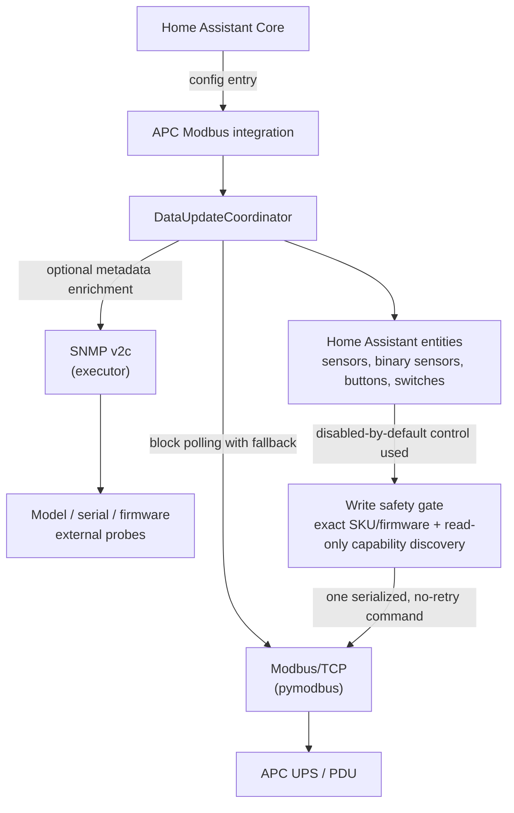

# APC UPS Modbus Integration for Home Assistant


A Home Assistant integration for monitoring APC power devices via Modbus/TCP with optional SNMP enrichment.

> **Development preview:** `2.0.0-dev.7` includes safety-gated write controls
> for a small allowlisted set of SMT/SmartConnect/SRT devices. See
> [Modbus write support status](WRITE_SUPPORT.md) before enabling them.

Supported device families include:
- Legacy Smart-UPS
- Smart-UPS SMT/SMX/SRT and SmartConnect
- NetShelter Rack PDU

This custom-component runs standalone and DOES NOT require additional components such as NUT or APCUPSD.

Modbus/TCP is an extremely efficient method for collecting bulk data at a high rate and is used in industrial automation services for
this purpose.

If you do not have a Modbus enabled APC device the project at https://github.com/aburow/ups-snmp-ha provides a similar capability using SNMP only.

## Features

### Multi-Device Support
- **Smart-UPS**: Traditional APC Smart-UPS devices
  - Full battery and load monitoring

- **NetShelter Rack PDU**: APC power distribution units
  - Dynamic entity creation based on device capabilities
  - Device-level power measurements (kW, kVA, kWh)
  - Per-phase measurements (L1, L2, L3) with current, voltage, power
  - Per-outlet monitoring (up to 64 metered outlets)
  - Per-bank monitoring (up to 12 banks)

### Smart-UPS Sensors
- Input/output voltage and current
- Battery charge percentage and runtime; remaining runtime supports Home Assistant duration-unit display preferences while retaining statistics
- Load percentage and transfer switch status
- Temperature and firmware information
- External temperature/humidity probes via SNMP (for supported environmental modules such as AP9335T/AP9335TH)
- Input/output frequency
- Real-time power measurements
- Status bits and fault indicators
- And more...

### Energy Counters

- Supported SMT/SMX/SRT, SmartConnect, and Rack PDU energy counters are
  normalized internally to whole Wh.
- Home Assistant exposes cumulative energy in kWh with a three-decimal display
  suggestion; the stored value remains unrounded for recorder statistics and
  Energy Dashboard use.
- SMT-compatible counters retain continuity across confirmed hardware resets
  and uint32 rollovers. Isolated or inconsistent counter decreases are ignored
  to prevent false energy jumps.
- Supported SMT/SmartConnect devices expose a default-enabled diagnostic
  **Output Energy Rollover** count. It tracks confirmed hardware wraps only;
  ordinary resets and rejected counter readings do not affect it.

### External Probe Behavior (AP9335T/AP9335TH)
- External probe sensors are optional and are created when compatible probe OIDs are detected by SNMP.
- When detected, external probe entities are enabled by default so they appear immediately in Home Assistant.
- If no compatible probe is connected, those entities are not created (instead of showing permanently unavailable sensors).
- Temperature is reported as native Celsius and exposed with Home Assistant temperature device class, so UI/unit settings can convert to Fahrenheit automatically.
- External probe availability (and the specific probe OID variants) are detected during the hourly SNMP metadata refresh; probe values are not polled unless a compatible probe was detected.
- If a compatible probe is connected or changed while Home Assistant is running, newly detected probe entities are added after the next hourly SNMP detection refresh. Removed probe entities may remain unavailable until the integration is reloaded.

### Core Features
- **Safety-Gated Write Controls**: Disabled by default and created only after
  exact SKU/firmware and per-feature capability checks. They remain a
  development-preview feature; see [Modbus write support status](WRITE_SUPPORT.md).
- **Clearer Activity Log**: Device-specific logs summarize Modbus outages and
  recovery, write outcomes, SNMP capability changes, and restored controls.
- **Optional SNMP Enrichment**: SNMP adds self-test data, input-frequency fallback, and compatible external probes. SMT/SMX/SRT and SmartConnect devices also supply model, SKU, serial, and firmware through a one-time Modbus identity read when SNMP is unavailable.
- **SmartConnect Dashboard**: SmartConnect device pages link to the
  [SmartConnect dashboard](https://smartconnect.apc.com/dashboard).
- **Device Family Coverage**: Legacy Smart-UPS, Smart-UPS SMT/SMX/SRT, and NetShelter Rack PDU
- **Dynamic Entity Generation**: Rack PDU creates only sensors for present hardware (no placeholder entities)
- **Easy Configuration**: Setup auto-detects UPS vs Rack PDU and picks the correct UPS register family
- **Manual Diagnostics Button**: Per-device `Run plugin diagnostics` button captures SNMP + Modbus raw dump and displays it in a Home Assistant persistent-notification modal for quick troubleshooting
- **Schema-Based Detection**: Modbus probes distinguish legacy Smart-UPS, SMT/SMX/SRT (including SmartConnect-compatible SMT schema), and Rack PDU register families without SNMP
- **No Re-detect On Connection Loss**: Temporary Modbus connectivity failures do not trigger automatic family rediscovery for already classified devices
- **Manual Re-detect Button**: Per-device `Re-detect Device Type` button reruns Modbus family probing and reloads the integration entry only when the stored type or detection metadata actually changes
- **Reset Monitor Defaults Button**: Per-device `Reset Monitor Defaults` button reapplies integration default entity enablement in Entity Registry
- **Connection Compatibility**: Devices that allow one request per TCP connection automatically use a safe per-request connection mode; it temporarily overrides `Keep Connection Open` without changing the user's preference
- **Startup Load Smoothing**: Large fleets are staggered deterministically during startup so initial SNMP metadata, Modbus detection, capability discovery, and first refresh do not all hit at once
- **Fleet-Aware Poll Guard**: Large fleets automatically apply a safer effective scan interval at runtime to reduce recorder/database write pressure
- **Resilient Modbus Compatibility**: Read calls adapt across common `pymodbus` unit-id API variants used in different environments
- **Local Communication**: Direct TCP/Modbus protocol (no cloud dependency)
- **Block Read Optimization**: Efficient register polling with fallback to individual reads
- **Consistent Icons**: Sensors and binary sensors use a shared local icon mapping.
- **Core-First Availability**: UPS integrations default-enable a core sensor set; Rack PDU defaults now enable core device + L1 metrics while non-core/dynamic extras remain opt-in in Entity Registry
- **Full Block Polling Preserved**: Block-read polling remains intact; disabled-by-default UPS extras affect default visibility/opt-in behavior, not register block strategy

## Architecture



## Installation

### Using HACS (Recommended)

1. Go to HACS in Home Assistant
2. Click the three-dot menu and select "Custom repositories"
3. Add repository: `https://github.com/aburow/apc-modbus-snmp-ha`
4. Select "Integration" category
5. Install "APC UPS Modbus"
6. Restart Home Assistant

### Manual Installation

1. Copy `custom_components/apc_modbus/` to `config/custom_components/` on your Home Assistant instance
2. Restart Home Assistant
3. Go to Settings → Devices & Services → Integrations
4. Click "Create Integration"
5. Search for "APC UPS Modbus"

## Configuration

After installation, set up the integration through the UI:

1. Go to **Settings → Devices & Services → Integrations**
2. Click **Create Integration**
3. Search for and select **APC UPS Modbus**
4. Fill in the required configuration:
   - **Host**: Modbus/TCP host name or address of the device
   - **SNMP Community**: SNMP community string (default: "public"; optional enrichment)
5. Optional advanced settings:
   - **Device Name**: Friendly name for the device (default: "APC UPS")
   - **Port**: Modbus/TCP port (default: 502)
   - **SNMP Port**: SNMP UDP port (default: 161)
   - **Unit ID**: Modbus unit ID (default: 1)
   - **Scan Interval**: Update interval in seconds (default: 10)
   - **Keep Connection Open**: Reuse Modbus TCP session across polls (default: disabled)

The integration auto-detects whether the device is a UPS or Rack PDU, and for UPS devices it auto-selects the correct register family.

When **Keep Connection Open** is enabled, the coordinator avoids per-cycle socket close/open overhead, but still reconnects automatically on socket errors and after long idle windows. Some APC devices permit only one Modbus request per TCP connection; the integration detects that transport constraint and safely reconnects for each request instead. In that mode, the Keep Connection Open preference remains stored but is not effective, and the idle-socket diagnostic is skipped. If your UPS exposes a Modbus TCP Timeout setting, set it higher than the configured polling interval; otherwise, disable **Keep Connection Open** for that device.

### SNMP Requirements

SNMP is optional. It enriches Modbus monitoring with device metadata, input-frequency fallback, external probes, and Smart-UPS self-test data:
- During setup, the integration attempts SNMP metadata retrieval without blocking Modbus detection
- If SNMP is unavailable, setup and Modbus monitoring continue; routine SNMP calls are disabled for that entry to avoid repeated failures
- SNMP-backed metadata and entities remain unavailable until you run **Re-detect Device Type**, which explicitly retries SNMP enrichment

### Logs and activity history

Operational messages identify the configured device and explain meaningful
state changes. During a communication outage the integration records one
warning such as `Modbus communication is unavailable; affected entities may be
unavailable. Home Assistant will retry automatically`, followed by one
`Modbus communication recovered` message when polling succeeds again. Detailed
register, block, OID, and reconnect diagnostics are available only with debug
logging.

When a device needs one Modbus connection per request, the integration reports
that compatibility mode in plain language. Write controls record whether a
command was **not sent**, **sent once** with a validated protocol response, or
may have been applied with an unknown outcome. Unknown writes are never
replayed automatically; verify the device state instead.

Home Assistant buttons retain their last press timestamp. After a control is
unavailable and later restored, the Logbook clarification `this is not another
press` explains that a displayed `Pressed` entry was not a second command.
Before sharing debug logs or diagnostics, redact SNMP communities, serial
numbers, host addresses, and all credential values.
- Current SNMP implementation uses SNMP v2c reads in this integration path

**Recommended Setup:**
- Ensure SNMP is enabled on the device (port 161)
- Use the correct SNMP community string (usually "public")
- Ensure network path is open between Home Assistant and device port 161
- If setup fails, check Home Assistant logs for SNMP error details

**Fallback Behavior:**
- If SNMP is unavailable at startup, the integration will still function and stops routine SNMP retry traffic
- Base Modbus sensors will work normally
- SMT/SMX/SRT and SmartConnect devices populate Device Info from Modbus with model/SKU, serial number, and firmware version
- Self-test data, input-frequency fallback, and external-probe data remain unavailable until SNMP is accessible
- Run **Re-detect Device Type** after correcting SNMP connectivity to retry enrichment

## Supported Devices

### Smart-UPS
- Smart-UPS 500 / 750 / 1000 / 1500 / 2200 / 3000 VA and larger
- Smart-UPS VT series
- Smart-UPS C series
- Any Smart-UPS model with Modbus/TCP support
- SmartConnect variants that expose the documented SMT Modbus schema

**Tested on:**
- Smart-UPS 1500
- Smart-UPS 3000

### NetShelter Rack PDU
- AP8xxx series (e.g., AP8652, AP8861)
- APDU models (e.g., APDU4-XM)
- Any NetShelter Rack PDU with Modbus/TCP support

**Capabilities:**
- 1 or 3 phase power distribution
- Up to 64 metered outlets
- Up to 12 branch circuits/banks
- Per-phase and per-outlet energy monitoring

**Tested on:**
- NetShelter Rack PDU AP8XXX series

## Requirements

- A current Home Assistant release compatible with Python 3.13
- APC UPS or Rack PDU with:
  - **Modbus/TCP** enabled (port 502, configurable)
  - **SNMP** enabled (port 161, optional; required only for SNMP enrichment)
- Network connectivity to the device
- Python 3.13+ (built into current Home Assistant)

## Tested Platforms

- Home Assistant Core runtime on Python 3.13
- APC Smart-UPS legacy family (examples tested: Smart-UPS 1500, Smart-UPS 3000)
- APC Smart-UPS SMT/SMX/SRT register family (multiple field dumps validated)
- APC NetShelter Rack PDU family (AP8xxx series in mixed single/three-phase deployments)

## Compatibility

- Requires `pymodbus>=3.1.1`; Home Assistant installs it from the integration manifest.
- SNMP enrichment uses Home Assistant's available SNMP support and does not add a separate `pysnmp` requirement.
- Supports common `pymodbus` unit-id calling variants (`device_id`, `slave`, `unit`, positional fallback) to tolerate runtime version differences.
- Designed to remain stable even when other custom integrations alter the Home Assistant Python package set.

## Entity Discovery

### Smart-UPS
The available entity set depends on the device family, supported register map,
and SNMP connectivity. Base Modbus entities are created during setup;
SNMP-backed values and optional external-probe entities require successful SNMP
capability detection.

### NetShelter Rack PDU
Entity creation is dynamic based on device capabilities:
- **Device-level sensors**: Always created (1 set)
  - Real Power, Apparent Power, Power Factor, Energy, Load State
- **Phase sensors**: Created based on number of phases (×1 or ×3)
  - Phase Current, Voltage, Power, Apparent Power, Power Factor, State
- **Outlet sensors**: Created for each metered outlet (×0-64)
  - Outlet Current, Power, Energy, Alarm State
- **Bank sensors**: Created for each bank (×0-12)
  - Bank Current, State

Rack PDU state-code sensors are exposed as human-readable text:
- Load/Phase/Bank State: `Unknown`, `Low`, `Normal`, `Near Overload`, `Overload`
- Outlet Alarm State: `Unknown`, `No Alarm`, `Warning`, `Alarm`, `Critical`

**Example:** A 3-phase Rack PDU with 24 metered outlets and 6 banks creates:
- 5 device-level sensors
- 18 phase sensors (6 per phase × 3 phases)
- 96 outlet sensors (4 per outlet × 24 outlets)
- 12 bank sensors (2 per bank × 6 banks)
- **Total: 131 entities**

## Troubleshooting

### Enable Home Assistant Debug Logging

When diagnosing setup, SNMP, or Modbus issues, enable debug logging for this integration in `configuration.yaml`:

```yaml
logger:
  default: info
  logs:
    custom_components.apc_modbus: debug
```

After updating the logger configuration:
- Restart Home Assistant
- Reproduce the issue
- Collect the relevant log lines from Home Assistant

At `debug` log level, the coordinator emits a timing breakdown:
- `Poll timing breakdown: total=..., lock_wait=..., modbus=..., connect=..., block_reads=..., individual_reads=..., close=..., snmp_metadata=..., snmp_external=...`
- Use this to identify whether latency is dominated by socket lock contention, Modbus reads, reconnects, or SNMP merges.

Notes:
- `snmp_metadata` is normally near-zero and only increases when the hourly SNMP metadata refresh runs.
- `snmp_external` includes SNMP input-frequency (used when Modbus does not provide `input_frequency`, especially on SMT devices) and any detected external temp/humidity probes.
- External temp/humidity probes are only polled after detection during the hourly SNMP metadata refresh.

For deeper data collection outside Home Assistant, use the standalone debug tools here:
- https://github.com/aburow/apc_modbus_debug

That repository is intended for gathering raw SNMP and Modbus data for compatibility analysis.

The built-in diagnostics button also includes:
- raw block reads for the current collector set
- exact device-family probe calls used by Home Assistant detection
- a derived detection summary based on those same probe results

For device-family correction without deleting and re-adding an entry, use the built-in `Re-detect Device Type` button from the device page.

### SNMP Connection Failed (Device Info Not Populated)
- **Symptom**: Device model, serial number, and firmware info are not shown for a device without the SMT/SmartConnect Modbus identity block
- **Check logs for**: "Unable to retrieve SNMP metadata after 3 attempts"
- **Impact**: Integration still works - all Modbus sensors function normally, but device info is empty
- **Solution**:
  1. Verify SNMP is enabled on the device (check device configuration)
  2. Check SNMP community string (usually "public" by default)
  3. Verify network connectivity: `ping <device-host>`
  4. Check firewall rules allow port 161 (UDP)
  5. Verify no network path issues: `timeout 5 nc -u <device-host> 161`
  6. Test SNMP manually: `snmpget -v 2c -c public <device-host> 1.3.6.1.4.1.318.1.1.1.1.1.1.0`
  7. Once fixed, restart Home Assistant or reload the integration

**Note:** After correcting SNMP settings or connectivity, use **Re-detect Device
Type** to retry SNMP enrichment without deleting the integration entry.

### Modbus Connection Issues
- **Error**: "Unable to connect to APC device"
- **Solution**:
  - Verify device host and port are correct
  - Check network connectivity: `ping <device-host>`
  - Ensure Modbus/TCP is enabled on the device

### PyModbus Environment Compatibility
- Home Assistant runtime behavior depends on the `pymodbus` version loaded in that environment.
- This integration now tolerates common unit-id call signatures (`device_id`, `slave`, `unit`, and positional fallback) to reduce version-skew issues.
- If another custom component alters your runtime package set, capture startup logs showing the detected `pymodbus` version for troubleshooting.
  - Check firewall rules allow port 502 (TCP)
  - Verify Home Assistant can reach port 502: `telnet <device-host> 502`

### Missing Rack PDU Sensors
- **Issue**: Fewer outlet/bank sensors than expected
- **Solution**:
  - This is expected behavior! Only metered outlets/banks are monitored
  - Check device configuration for number of metered outlets/banks
  - Read capability registers to verify device configuration

### Slow Updates
- **Issue**: Long update cycle time (> 15 seconds)
- **Solution**:
  - Reduce scan interval setting if too frequent
  - Check Home Assistant system performance
  - For Rack PDU with many outlets, expect longer update cycles
  - Verify network latency to device: `ping <device-host>`

### Large Fleet Startup Behavior
- **Behavior**: When many APC entries are present, startup work is staggered across a bounded window instead of all devices probing at once.
- **Why**: This reduces first-start polling spikes that can otherwise cause partial Modbus failures in larger deployments.
- **What to expect**:
  - Small fleets start immediately.
  - Larger fleets may take up to 60 seconds for the last APC entry to begin its heavy startup polling.
  - Normal steady-state polling cadence is unchanged after startup.

### Device Type Not Detected
- **Issue**: Auto-detection picks the wrong device family or setup fails
- **Solution**:
  - Review Home Assistant debug logs for the Modbus probe results
  - Confirm the device responds on Modbus/TCP port 502
  - Use the external dump/debug tooling to capture SNMP and Modbus responses for analysis

## Version

Current version: `2.0.0-dev.7`. See [CHANGELOG.md](CHANGELOG.md) for release notes.

## Support

- **Issues**: Report bugs on [GitHub Issues](https://github.com/aburow/apc-modbus-snmp-ha/issues)

## License

This project is licensed under the GNU Affero General Public License v3.0 or later.

SPDX-License-Identifier: AGPL-3.0-or-later

The author is not affiliated with APC or Schneider Electric. Use of this
software is at the user's or installer's own risk.

## Credits

Developed for Home Assistant integration with APC UPS and Rack PDU devices via Modbus/TCP protocol.
